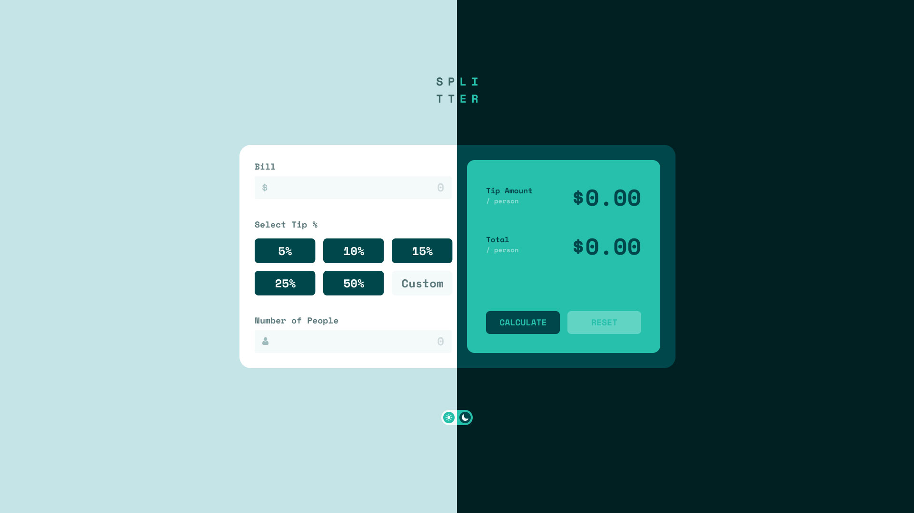

# tip-calculator-react (in progress)
App to calculate the bill and divide by the number of people.

## Overview

### Test the project:

- clone or fork the repository.
- run **npm install** for the dependences.
- **npm run dev** to start the server and open on http://localhost:3000 in the browser.

### Users should be able to:

- Calculate the correct tip and total cost of the bill per person
- Choose between light and dark theme.

## My process

### Built with

- Vite
- React Js
- Typescript
- Styled-components

## Author

- Linkedin - [Décio Neto](https://www.linkedin.com/in/decioneto/) :wave: